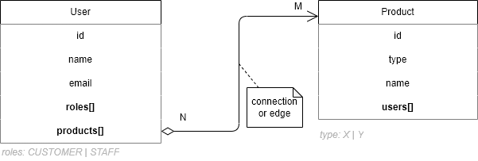
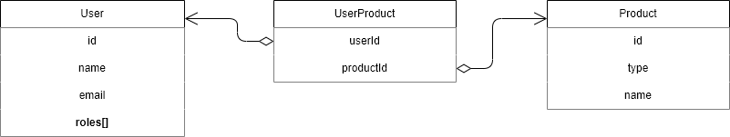
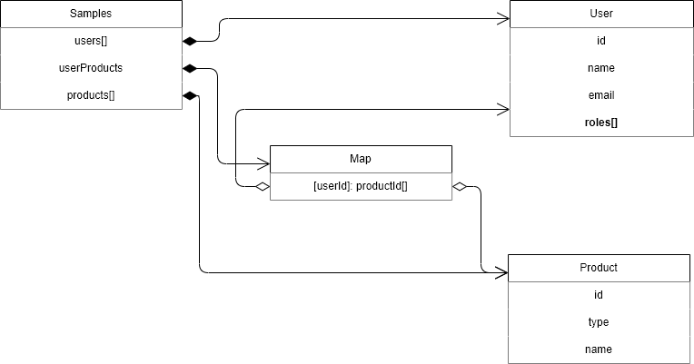
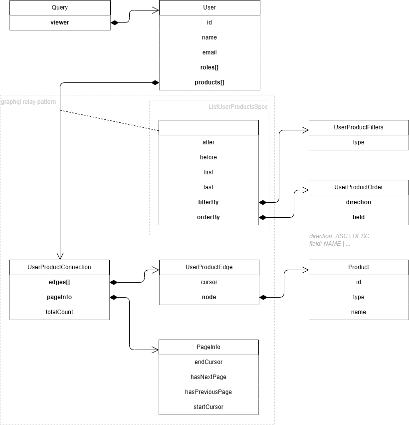

# Sample GraphQL Java

[](https://github.com/akornatskyy/sample-graphql-java/actions/workflows/tests.yaml)

A service that uses [graphql-java](https://www.graphql-java.com/) and
spring boot.

## Build

Run any checks to verify the package is valid and meets
quality criteria.

```sh
mvn -T1C clean verify
```

## Data Model



### Relational View



### Samples View



### GraphQL View



## Tools

- [GraphQL Playground](https://github.com/graphql/graphql-playground)
